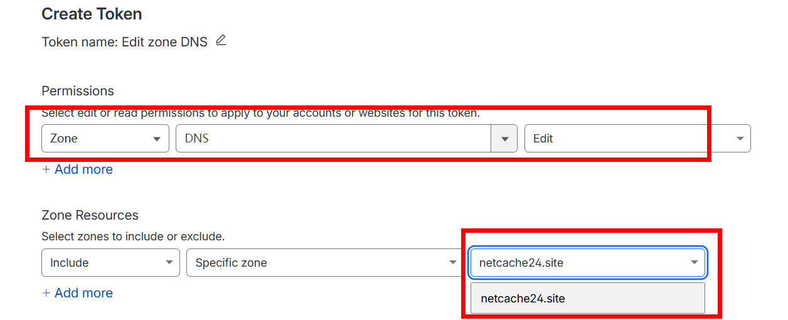

# SSH-Toolkit-Lite

一个用于 Linux 服务器的交互式脚本工具箱，主要用于一键处理 SSH 端口、Nginx、sing-box 以及证书签发和代理配置。

## 功能

- 修改 SSH 端口
- 安装并启动 Nginx
- 安装 sing-box
- 为域名签发 TLS 证书
- 生成 Hysteria2 配置
- 生成 VLESS + TLS 配置


## 运行环境

- Linux 服务器，主要支持 Debian / Ubuntu
- 需要 `root` 或 `sudo` 权限执行大部分操作
- 可能需要域名和cf api token
- 修改 SSH 端口时需要能使用 `sudo` 或 root 权限
- 签发证书时可能需要域名和 Cloudflare API Token

## 使用方法

一键安装脚本：

```bash
wget -P /root -N --no-check-certificate "https://raw.githubusercontent.com/suolk/ssh-toolkit-lite/main/setup.sh" && chmod 700 /root/setup.sh && /root/setup.sh
```

下载整个项目源码包，再进入目录运行：

```bash
wget -O SSH-Toolkit-Lite.tar.gz https://github.com/suolk/ssh-toolkit-lite/archive/refs/heads/main.tar.gz
tar -xzf SSH-Toolkit-Lite.tar.gz
cd SSH-Toolkit-Lite-main
bash Entrance.sh
```

如果你已经在服务器上直接有仓库目录，直接运行主入口即可：

```bash
bash Entrance.sh
```

启动后会显示菜单，可按编号选择功能。

## 证书签发方式

`Command/installCert.sh` 支持三种方式：

- `standalone`：占用 80 端口直接签发
- `webroot`：依赖正在运行的 Nginx
- `dns`：使用 Cloudflare API Token 进行 DNS-01 签发

如果选择 `dns` 模式，需要先在 Cloudflare 获取 API Token：

1. 登录 Cloudflare 控制台。
2. 进入 My Profile 或个人资料页面。
3. 打开 API Tokens。
4. 点击 Create Token 创建新 Token。
5. 推荐直接使用 Edit zone DNS 模板，或为目标域名单独创建只允许 DNS 编辑的 Token。
   
6. 创建完成后，把 Token 复制出来，在脚本提示时粘贴输入。
7. 注意Token只在第一次出现时显示，请务必妥善保存到本地。

这个 Token 不需要对外公开，也不要提交到 GitHub 仓库。

证书默认保存到：

```text
/etc/encrypt/<domain>/fullchain.pem
/etc/encrypt/<domain>/privkey.pem
```

## 配置输出

- Hysteria2 配置：`/etc/sing-box/hysteria2/config.json`
- Hysteria2 分享链接：`/etc/sing-box/hysteria2/share_link.txt`
- VLESS 配置：`/etc/sing-box/vless/config.json`
- VLESS 分享链接：`/etc/sing-box/vless/share_link.txt`

## 注意事项

- `Command/installNginx.sh` 目前写死为 `apt` 安装流程，因此这一功能仅适用于 Debian / Ubuntu 系发行版。
- `Command/installSingbox.sh` 会根据系统架构下载 sing-box，当前支持 `amd64` 和 `arm64`。
- Hysteria2 会自动生成随机端口、用户名、密码和 obfs 密码。
- VLESS 默认监听 `443` 端口，并使用随机生成的 `uuid`。
- 主菜单中包含 `Deploy Vless + Reality` 选项，但仓库当前没有对应的 `Command/installReality.sh` 文件，待开发中。

## 依赖说明

入口脚本会尽量自动安装缺失依赖，包括：

- `getent`
- `ss`
- `shuf`
- `uuidgen`
- `ufw`
`Command/setSSHDPort.sh` 会使用 `ufw` 查看并放行 SSH 新端口，缺失时会尝试自动安装。

`Command/installCert.sh` 还依赖：

- `curl`
- `openssl`
- `lsof`
- `acme.sh`

## 建议流程

1. 先配置好可解析到服务器的域名。
2. 运行主入口并安装 Nginx 或确认 80 端口可用。
3. 先签发证书，再生成 Hysteria2 或 VLESS 配置。
4. 按生成的 `share_link.txt` 内容导入客户端。
